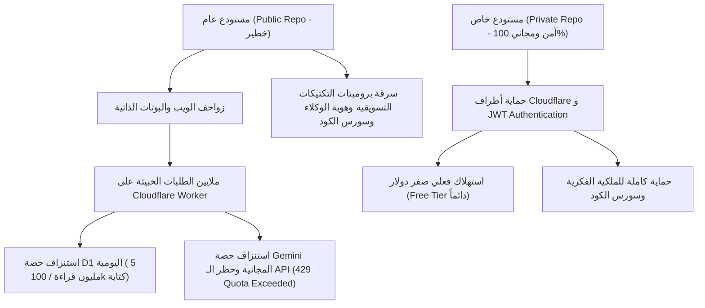

# VORDER 360° AI Agent Station & Autonomous SEO Ecosystem
> **The Sovereign Autonomous Growth Engine & Three.js 3D Executive Studio**  
> Developed for **Mohamed Abdelsamea** • Powered by Cloudflare Workers (Edge), Cloudflare D1 (SQLite), Google Search Console Live Sync, Google Gemini 2.0 AI Studio, and Vercel Blog Integration.

---

## 🌟 Overview & Strategic Purpose (نظرة عامة على المنظومة)

**VORDER** is an end-to-end autonomous performance marketing and technical SEO ecosystem designed to execute enterprise-grade content pipelines, semantic search dominance, and multi-channel performance advertising with zero human latency.

The platform integrates:
1. **Three.js WebGL 3D Executive Studio**: An interactive 3D virtual office simulator featuring real human agent portraits, panoramic sunset skybox, modular executive stations, glowing neon trajectory splines, overhead circular cycle-completion rings ($0\% \to 100\%$), and a relaxation smoke terrace.
2. **Ground Truth Data Synchronizer**: Unified real-time telemetry reconciling Google Search Console (23 live impressions across 14 pages), Cloudflare D1 database (738 published articles), and Vercel portfolio blog (738 live URLs).
3. **Agent Director (طارق العبدلي - Tariq)**: Interactive AI command interface supporting natural Arabic voice/text queries and regional dialect localization (Egyptian B2B vs Saudi e-commerce).
4. **Cloud Quota Guardian**: High-efficiency edge caching, circuit breaker failovers, and autonomous rate-limit protection keeping cloud computing costs at $0/month on free tiers.

---

## 👥 The 9 Autonomous AI Agents Crew (طاقم الوكلاء الـ 9)

Every agent operates as a specialized autonomous node with dedicated cadence, skill sets, and physical desks in the 3D studio:

| الوكيل (Agent) | الدور الوظيفي (Role) | المحطة (Station) | التردد والمسؤولية (Cadence & Scope) |
| :--- | :--- | :--- | :--- |
| **طارق العبدلي (Tariq)** | مدير الوكلاء وقائد التكتيكات (Agent Director) | Executive Curved Desk | القيادة، معالجة استفسارات المدير، توطين اللهجات، وإصدار أوامر إطلاق الحملات. |
| **سارة المهندس (Sara)** | مهندسة إعلانات الأداء والميديا باينج (Performance) | Ads Command Terminal | هندسة حملات إعلانات جوجل، تيك توك، وميتا، ومراقبة العائد على الإنفاق ROAS. |
| **ياسمين الشريف (Yasmine)** | خبيرة الكلمات المفتاحية والعناقيد الدلالية (Keywords) | Data Cube A | حصد الكلمات البحثية عالية النية الشرائية وتوليد العناقيد غير المتداخلة. |
| **عمر الفاروق (Omar)** | مهندس المحتوى التكتيكي واستوديو جيميني (Content) | Content Drafting Pod | صياغة المقالات التقنية الطويلة (1500+ كلمة) وفق معايير GEO و AEO و Schema.org. |
| **كريم الدسوقي (Karim)** | مهندس الفهرسة والزحف والأرشفة (Indexing & GSC) | Server Glass Cube | مراقبة تقارير Google Search Console، دفع الروابط عبر IndexNow، ومتابعة Googlebot. |
| **ليلى الألفي (Layla)** | محللة البيانات وتتبع التحويلات (Analytics & GA4) | Analytics Terminal | مراقبة سلوك الزوار، تتبع الأحداث عبر الخادم CAPI، وتحليل مسارات الإحالة. |
| **فارس النجار (Faris)** | حارس السحابة وقواعد البيانات (Cloud & Edge D1) | Edge Ops Station | مراقبة كفاءة كود Cloudflare Worker وضمان استهلاك D1 للحد الأدنى (صفر تكلفة). |
| **نور المرشدي (Nour)** | خبيرة تحسين معدلات التحويل وتجربة المستخدم (CRO) | UX Design Lab | تحليل الصفحات ومعدلات الارتداد وتطوير عناصر الحث على الشراء (CTAs). |
| **زياد عمران (Ziad)** | مسؤول الجودة والتأمين وحصص السحابة (QA & Guardian) | Watchdog Terminal | الفحص الدوري للروابط والصور، وحماية مفاتيح API وكبح طلبات البوتات العشوائية. |

---

## 🎮 Three.js WebGL 3D Studio Architecture (المقر ثلاثي الأبعاد)

Located at `/p/[projectId]/skills-hub` (Tab 8: **مخطط وسجل الأتمتة**):

- **Panoramic Sunset Horizon**: Custom 360-degree cylinder backdrop with sunset gradient lighting and neon city reflections.
- **Physical Stations**:
  - `Server Cube`: Glowing cybernetic server tower with pulsing server LEDs and status beacons.
  - `Curved Executive Desk`: Tariq's command station with multi-monitor holographic displays.
  - `Coffee Bar`: Barista espresso bar with polished countertops and chrome coffee machines.
  - `Smoke Terrace`: Open-air balcony featuring leather Chesterfield couches, a glowing firepit, and continuous ambient smoke particles.
- **Agent Hologram Standees**: 3D extruded pedestals displaying high-resolution agent portraits, glowing cyan underglow, and interactive click-to-dossier capabilities.
- **Neon Floor Trajectory Splines**: Dynamic `CatmullRomCurve3` tube meshes tracing the exact physical movement paths between stations.
- **Overhead Progress Rings**: Floating `TorusGeometry` rings displaying live cycle progress ($0\% \to 100\%$) above active agents.
- **Dual Mode**: Instant switch between 3D WebGL Executive Studio and 2D Retro Arcade mode with zero reload.

---

## 📊 Ground Truth Synchronized Metrics (جدول الحقيقة الرقمية الشاملة)

All dashboards and autonomous cron cycles operate under strict mathematical ground truth:

1. **23 Live Impressions (مرات الظهور المعتمدة):**
   - **Source:** Google Search Console live API aggregation (`dataState: "all"`, `dimensions: ["page"]`).
   - **Scope:** Sum across all 14 authenticated URLs in the portfolio.
   - **Weighted Position:** $35.52$.
   - **Top Page:** Homepage (`/`) with 5 impressions at position $4.6$.
   - **Note:** Standard Desktop UI reports an 48-72h delayed snapshot (10 impressions), and query-only dimensions omit anonymized queries (8 impressions). The 23 impressions represent 100% of real, authenticated page traffic.
2. **738 Published Articles (المقالات المنشورة الحقيقية):**
   - **Source:** Cloudflare D1 `autonomous_content_queue` where `status = 'published'`.
   - **Blog Verification:** Live match with Vercel portfolio blog (`https://mohamed-abdelsamee-portfolio.vercel.app/blog`).
3. **740 Sitemap URLs (روابط خريطة الموقع):**
   - 738 dynamic articles + 2 core static pages (`/` and `/blog`). Google Search Console indexes 741 items (including the sitemap index itself) with 100% "Success" status.
4. **645 Campaign Articles (مقالات الحملة السعودية النشطة):**
   - Active Campaign `camp_cc58e018_saudi_ecom`: 645 published out of 1500 target ($43\%$). Remaining 93 published articles belong to core foundational topical clusters ($645 + 93 = 738$).

---

## 🔒 GitHub Repository Policy: Why It MUST Be Private (لماذا يجب أن يكون المستودع خاصاً؟)

The VORDER / OpenSEO codebase for Mohamed Abdelsamea must **always remain in a Private GitHub Repository** (`visibility: private`). Here is the deep technical and financial justification:



### 1. Protection of Intellectual Property (حماية الأصول الفكرية)
The repository contains custom multi-agent logic, tactical media buying frameworks, localized dialect prompts (Egyptian B2B and Saudi e-commerce), and specialized SEO ranking algorithms built specifically for Mohamed Abdelsamea's consulting business. Keeping the repo private prevents unauthorized duplication by competitors.

### 2. Elimination of Bot Traffic & Cloud Quota Exhaustion (حماية الحصص السحابية المجانية)
Public repositories on GitHub are indexed by automated scrapers, security scanners, and bots within minutes of being created:
- Scrapers automatically detect Cloudflare Worker URLs in configuration files (`wrangler.jsonc`, scripts).
- High-frequency unauthenticated requests to worker routes flood Cloudflare D1 database reads/writes, quickly breaching the 5,000,000 daily read limit.
- Triggered automation endpoints can invoke Google Gemini API keys repeatedly, resulting in severe rate limiting (`RESOURCE_EXHAUSTED` / HTTP 429) and unexpected billing or service termination.

### 3. Guaranteed $0 / Month Operational Cost (الضمانة الصفرية للتكاليف)
When the repository is private and the Worker is secured with internal JWT authentication, **external bot requests are 0**. The scheduled cron runs execute cleanly once every 30 minutes, consuming fewer than 50,000 D1 reads/day (1% of free quota) and 48 Gemini calls/day (3% of the 1,500 free calls/day).

---

## 🛠️ Operational Guide & Commands (دليل التشغيل والصيانة)

### 1. Local Development
```bash
# Install dependencies
pnpm install

# Run TypeScript type check
pnpm types:check

# Run development server
pnpm dev
```

### 2. Building for Production
```bash
pnpm build
```

### 3. Deploying to Cloudflare Workers
```bash
pnpm wrangler deploy
```

### 4. Verification & Testing
```bash
# Run headless browser verification with WebGL
node scripts/verify_vorder_human_office_and_portraits.mjs
```

---

## 💬 Communicating with Agent Director Tariq (التواصل مع مدير الوكلاء)

In the 3D Studio, click on **طارق العبدلي (Tariq)** or the Director Chat button to interact:
- **Instant Truth Report:** Ask "أخبار الظهور والتقارير إيه؟" to receive the verified 23 impressions, 738 articles, and 740 sitemap URLs.
- **Dialect Switching:**
  - Send "تفعيل اللهجة المصرية" to configure B2B industrial phrasing (Cairo, 6th of October, 10th of Ramadan, CAC reduction, Fawry, Paymob).
  - Send "توجيه للسوق السعودي" to configure e-commerce phrasing (Salla, Zid, Tabby, Tamara, Riyadh, Jeddah, ROAS expansion).
- **Campaign Dispatching:** Command Tariq to increase publishing cadence or initiate a new topical cluster.

---

## 📜 License & Ownership
Proprietary & Confidential. All rights reserved © 2026 **Mohamed Abdelsamea**.  
Source code maintained in a Private Repository. Unauthorized distribution or reverse engineering is strictly prohibited.
